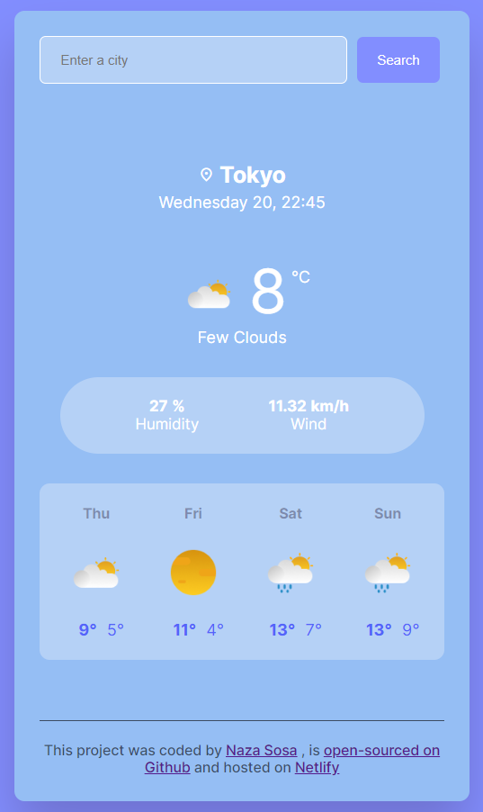

# My First SheCodes Project - Weather App

## Table of contents

- [Overview](#overview)
  - [Screenshot](#screenshot)
  - [Links](#links)
- [My process](#my-process)
  - [Build with](#build-with)

## Overview
This project is a weather app that utilizes the SheCodes API to fetch weather data for select countries.
Users can search for specific countries and view the current temperature, humidity value, wind value
and the forecast for the next four days.
The primary focus of this project was to demonstrate the integration of the SheCodes API and the manipulation of weather data.

### Screenshot

    

### Links
- Repository URL: [https://github.com/nazasosaro/weather-app]
- Weather App URL: [https://meteo-site.netlify.app/]

## My process
### Build with
- HTML
- CSS
- Vainilla JavaScript
